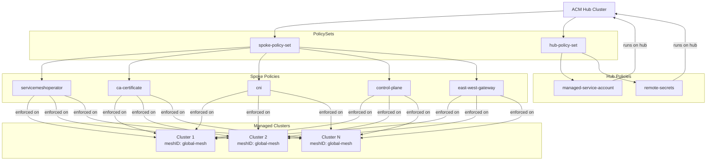

# Scalable Multi-Cluster Istio with ACM Policies

Simplify multi-cluster Istio deployment using ACM (Advanced Cluster Management) Governance Framework. Apply a single set of policies once, then scale the mesh to any number of clusters by adding a label.

## The problem

Deploying Istio in multi-primary mode requires repeating the same steps on every cluster: install the operator, distribute the CA certificate, deploy CNI, configure the control plane, and set up the east-west gateway. That alone is 5 operations per cluster. On top of that, each cluster needs a remote secret for every other cluster so that control planes can discover services across the mesh — that's n * (n - 1) operations.

| Clusters | Per-cluster setup (5 * n) | Remote secrets (n * (n-1)) | **Total** |
|----------|--------------------------|----------------------------|-----------|
| 2        | 10                       | 2                          | **12**    |
| 3        | 15                       | 6                          | **21**    |
| 100      | 500                      | 9,900                      | **10,400**|

Adding or removing a single cluster requires touching every existing cluster to update remote secrets — the operational cost grows quadratically.

**This project reduces it to a constant:** apply 7 policies once, then add or remove clusters from the mesh by toggling a single label (`meshID: global-mesh`). The policies handle everything automatically, including the n * (n - 1) remote secret distribution.

## Architecture



## Demo

### Prerequisites

- OpenShift or Kubernetes cluster with ACM hub installed
- `kubectl` CLI configured to access the ACM hub cluster
- Managed clusters imported into ACM
- (Optional) cert-manager operator installed on the hub cluster — only required if you want to use cert-manager to generate the Istio CA certificate (see [Step 2](#step-2-optional-create-ca-certificates-with-cert-manager)). On OpenShift, install it via OperatorHub by subscribing to the `openshift-cert-manager-operator` package.

### Step 1: Create the policy namespace

Create a namespace on the hub cluster to hold ACM policies:

```bash
kubectl create namespace global-mesh-policies
```

### Step 2 (Optional): Create CA certificates with cert-manager

If you want to use cert-manager to generate the Istio CA certificate, apply the cert-manager resources. This creates a self-signed ClusterIssuer, a root CA Certificate/Issuer, and an intermediate Istio CA Certificate. The resulting `cacerts` Secret will be used by the `istio-ca-certificate` policy to distribute the CA to managed clusters.

If you prefer to provide your own CA certificate, skip this step and manually create a `kubernetes.io/tls` Secret named `cacerts` in the `global-mesh-policies` namespace with `tls.crt`, `tls.key`, and `ca.crt` keys.

```bash
kubectl apply -f acm/service-mesh/certificates/
```

Verify the certificates are ready:

```bash
kubectl get certificates -n global-mesh-policies
```

### Step 3: Create Placements and ManagedClusterSetBinding

Create the ManagedClusterSetBinding and both Placements in a single command. The ManagedClusterSetBinding grants the `global-mesh-policies` namespace access to the `default` ManagedClusterSet. The `global-mesh-clusters` Placement selects managed clusters labeled `meshID=global-mesh`. The `local-cluster` Placement selects the hub cluster:

```bash
kubectl apply -f - <<EOF
apiVersion: cluster.open-cluster-management.io/v1beta2
kind: ManagedClusterSetBinding
metadata:
  name: default
  namespace: global-mesh-policies
spec:
  clusterSet: default
---
apiVersion: cluster.open-cluster-management.io/v1beta1
kind: Placement
metadata:
  name: global-mesh-clusters
  namespace: global-mesh-policies
spec:
  predicates:
    - requiredClusterSelector:
        labelSelector:
          matchLabels:
            meshID: global-mesh
---
apiVersion: cluster.open-cluster-management.io/v1beta1
kind: Placement
metadata:
  name: local-cluster
  namespace: global-mesh-policies
spec:
  predicates:
    - requiredClusterSelector:
        labelSelector:
          matchLabels:
            name: local-cluster
EOF
```

### Step 4: Apply all policies

Apply all service mesh policies:

```bash
kubectl apply -f acm/service-mesh/policies/
```

This creates the following policies in the `global-mesh-policies` namespace:

- **`servicemeshoperator`** — installs the OpenShift Service Mesh 3 operator via OLM.
- **`ca-certificate`** — distributes the Istio CA certificate from the hub to managed clusters as a `cacerts` Secret in `istio-system`.
- **`cni`** — creates the `istio-cni` Namespace and `IstioCNI` resource.
- **`control-plane`** — creates the `istio-system` Namespace (with network topology label), the `Istio` resource, and a ClusterRoleBinding for the istio-reader ManagedServiceAccount.
- **`east-west-gateway`** — creates a Kubernetes Gateway for cross-network traffic on port 15443.
- **`managed-service-account`** — creates a ManagedServiceAccount per mesh cluster on the hub (runs on `local-cluster`).
- **`remote-secrets`** — distributes Istio remote secrets across clusters via ManifestWork (runs on `local-cluster`).

### Step 5: Create PolicySets

Create two PolicySets to bind the policies to their respective Placements.

The `spoke-policy-set` binds policies that run on managed clusters to the `global-mesh-clusters` Placement:

```bash
kubectl apply -f - <<EOF
apiVersion: policy.open-cluster-management.io/v1beta1
kind: PolicySet
metadata:
  name: spoke-policy-set
  namespace: global-mesh-policies
spec:
  policies:
    - servicemeshoperator
    - ca-certificate
    - cni
    - control-plane
    - east-west-gateway
---
apiVersion: policy.open-cluster-management.io/v1
kind: PlacementBinding
metadata:
  name: spoke-policy-set
  namespace: global-mesh-policies
placementRef:
  apiGroup: cluster.open-cluster-management.io
  kind: Placement
  name: global-mesh-clusters
subjects:
  - apiGroup: policy.open-cluster-management.io
    kind: PolicySet
    name: spoke-policy-set
EOF
```

The `hub-policy-set` binds policies that run on the hub cluster to the `local-cluster` Placement:

```bash
kubectl apply -f - <<EOF
apiVersion: policy.open-cluster-management.io/v1beta1
kind: PolicySet
metadata:
  name: hub-policy-set
  namespace: global-mesh-policies
spec:
  policies:
    - managed-service-account
    - remote-secrets
---
apiVersion: policy.open-cluster-management.io/v1
kind: PlacementBinding
metadata:
  name: hub-policy-set
  namespace: global-mesh-policies
placementRef:
  apiGroup: cluster.open-cluster-management.io
  kind: Placement
  name: local-cluster
subjects:
  - apiGroup: policy.open-cluster-management.io
    kind: PolicySet
    name: hub-policy-set
EOF
```

### Step 6: Label managed clusters

Label each cluster that should join the Istio mesh:

```bash
kubectl label managedcluster <cluster-name> meshID=global-mesh
```

Verify the labels:

```bash
kubectl get managedclusters -l meshID=global-mesh
```

Verify all policies are compliant:

```bash
kubectl get policy -n global-mesh-policies
```

### GitOps Pull Model Deployment

After the service mesh is deployed, you can set up the GitOps pull model to deploy applications across all clusters using Argo CD ApplicationSets. This installs the OpenShift GitOps operator on every cluster in the default ManagedClusterSet via an OperatorPolicy and registers them with the hub's Argo CD instance via a GitOpsCluster resource.

Create the policy namespace:

```bash
kubectl create namespace gitops-policies
```

Create the ManagedClusterSetBinding, Placement, OperatorPolicy, and PlacementBinding:

```bash
kubectl apply -f - <<EOF
apiVersion: cluster.open-cluster-management.io/v1beta2
kind: ManagedClusterSetBinding
metadata:
  name: default
  namespace: gitops-policies
spec:
  clusterSet: default
---
apiVersion: cluster.open-cluster-management.io/v1beta1
kind: Placement
metadata:
  name: all-clusters
  namespace: gitops-policies
spec: {}
---
apiVersion: policy.open-cluster-management.io/v1
kind: Policy
metadata:
  name: openshift-gitops-operator
  namespace: gitops-policies
spec:
  remediationAction: enforce
  disabled: false
  policy-templates:
    - objectDefinition:
        apiVersion: policy.open-cluster-management.io/v1beta1
        kind: OperatorPolicy
        metadata:
          name: openshift-gitops-operator
        spec:
          remediationAction: enforce
          severity: high
          operatorGroup:
            name: global-operators
            namespace: openshift-operators
          subscription:
            name: openshift-gitops-operator
            namespace: openshift-operators
            channel: latest
            source: redhat-operators
            sourceNamespace: openshift-marketplace
          upgradeApproval: Automatic
          complianceType: musthave
          removalBehavior:
            operatorGroups: DeleteIfUnused
            customResourceDefinitions: Keep
---
apiVersion: policy.open-cluster-management.io/v1
kind: PlacementBinding
metadata:
  name: openshift-gitops-operator
  namespace: gitops-policies
placementRef:
  apiGroup: cluster.open-cluster-management.io
  kind: Placement
  name: all-clusters
subjects:
  - apiGroup: policy.open-cluster-management.io
    kind: Policy
    name: openshift-gitops-operator
EOF
```

Once the operator is installed and the `openshift-gitops` namespace is created, register managed clusters with the hub's Argo CD instance. The GitOpsCluster is required because ApplicationSet's `clusterDecisionResource` generator needs managed clusters registered as Argo CD cluster secrets to resolve Placement decisions into deployment targets:

```bash
kubectl apply -f - <<EOF
apiVersion: cluster.open-cluster-management.io/v1beta2
kind: ManagedClusterSetBinding
metadata:
  name: default
  namespace: openshift-gitops
spec:
  clusterSet: default
---
apiVersion: cluster.open-cluster-management.io/v1beta1
kind: Placement
metadata:
  name: all-clusters
  namespace: openshift-gitops
spec: {}
---
apiVersion: apps.open-cluster-management.io/v1beta1
kind: GitOpsCluster
metadata:
  name: all-clusters
  namespace: openshift-gitops
spec:
  argoServer:
    cluster: local-cluster
    argoNamespace: openshift-gitops
  placementRef:
    apiVersion: cluster.open-cluster-management.io/v1beta1
    kind: Placement
    name: all-clusters
EOF
```

Create the Placements and `acm-placement` ConfigMap required by the `clusterDecisionResource` generator:

```bash
kubectl apply -f argocd/placement/
```

Label one cluster as `v1` and another as `v2`:

```bash
kubectl label managedcluster <cluster-1-name> app-version=v1
kubectl label managedcluster <cluster-2-name> app-version=v2
```

Deploy the sample applications via ApplicationSets. Each ApplicationSet uses the [bjw-s/app-template](https://bjw-s-labs.github.io/helm-charts/docs/app-template/) Helm chart and creates the `sample` namespace with Istio sidecar injection enabled:

```bash
kubectl apply -f argocd/applicationsets/
```

This creates the following ApplicationSets:

- **`helloworld-v1`** — deploys helloworld v1 (Service + Deployment) on clusters labeled `app-version=v1`.
- **`helloworld-v2`** — deploys helloworld v2 (Service + Deployment) on clusters labeled `app-version=v2`.
- **`curl`** — deploys the curl client on clusters labeled `app-version=v1`.

Verify the ApplicationSets were created:

```bash
kubectl get applicationsets -n openshift-gitops
```

Verify the generated Applications:

```bash
kubectl get applications -n openshift-gitops
```

Verify multicluster connectivity from the curl pod on the v1 cluster:

```bash
kubectl exec -n sample -c curl "$(kubectl get pod -n sample -l app=curl -o jsonpath='{.items[0].metadata.name}')" -- curl -sS helloworld.sample:5000/hello
```

### Verification with sample applications

### Step 7: Create the sample-policies namespace

Create a dedicated namespace on the hub cluster for sample application policies:

```bash
kubectl create namespace sample-policies
```

### Step 8: Label managed clusters with app-version

Label one cluster as `v1` and another as `v2`. The `v1` cluster will run helloworld-v1 and curl, while the `v2` cluster will run helloworld-v2:

```bash
kubectl label managedcluster <cluster-1-name> app-version=v1
kubectl label managedcluster <cluster-2-name> app-version=v2
```

### Step 9: Create the Placements for v1 and v2 clusters

Apply the ManagedClusterSetBinding, mesh-clusters Placement, and version-specific Placements that select clusters by `app-version` label:

```bash
kubectl apply -f acm/applications/placement/
```

### Step 10: Create the sample namespace

Apply the namespace policy to create the `sample` namespace with Istio sidecar injection enabled on all mesh clusters:

```bash
kubectl apply -f acm/applications/namespace/
```

Verify policy compliance:

```bash
kubectl get policy sample-namespace -n sample-policies
```

### Step 11: Deploy the helloworld application

Apply the helloworld policies. This creates the helloworld Service on all mesh clusters, then deploys helloworld-v1 to v1 clusters and helloworld-v2 to v2 clusters:

```bash
kubectl apply -f acm/applications/helloworld/
```

Verify policy compliance:

```bash
kubectl get policy -n sample-policies | grep helloworld
```

### Step 12: Deploy the curl client

Apply the curl policy to deploy the curl client on v1 clusters:

```bash
kubectl apply -f acm/applications/curl/
```

Verify policy compliance:

```bash
kubectl get policy curl -n sample-policies
```

### Step 13: Verify multicluster connectivity

From the curl pod on the v1 cluster, send requests to the helloworld service. You should see responses from both v1 and v2:

```bash
kubectl exec -n sample -c curl "$(kubectl get pod -n sample -l app=curl -o jsonpath='{.items[0].metadata.name}')" -- curl -sS helloworld.sample:5000/hello
```
